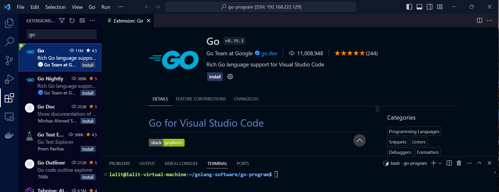
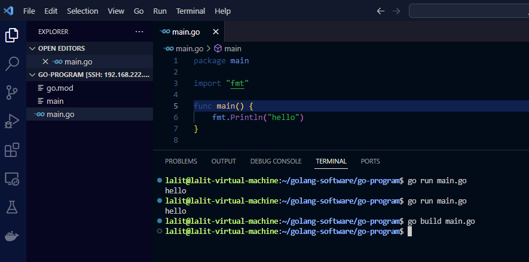

**Go** is also referred to as Golang, it is a free and open-source programming language designed at Google by Robert Griesemer, Rob Pike, and Ken Thompson. It is an apple to many a developer’s eye due to its simplicity, efficiency, and concurrency. Its concurrent nature implies means its ability to run multiple tasks at the same time.

It is mostly used for backend purposes such as server-side programming. It features majorly in the game and cloud-native development,  development of command-line tools, data science, and many more use cases.

## Install Go from the Official Binary Package

This is the most preferred installation method as it provides the latest version of Golang Go and cuts across all Linux distributions. To achieve this, follow the steps outlined.

### Step 1:  Download the Go

The first step in installing Go is to update the system. So log in to your server and update the local package index as shown.

```R
$ sudo apt update
```

### Step 2:  Download the Go Binary Package

The next step is to download the installation file which is a tarball file. To download it, head over to the official Go download page and download the 64-bit tarball installation file ( amd64.tar.gz )

On the command line, you can download the latest tarball file using the wget command. At the time of writing this guide, the latest version of Go is Go 1.20.1. This is likely to change by the time you are reading this guide, so ensure to replace the version number accordingly.

[Go lang version](https://go.dev/dl/)

```R
$ wget https://go.dev/dl/go1.21.4.linux-amd64.tar.gz
```

### Step 3:  Unzip the tarball file & move it to /usr/local directory

Once the download is complete, unzip the tarball to the ==**/usr/local/**== directory which is the primary directory for executable files.

```R
$ sudo tar -C /usr/local -xzf go1.21.4.linux-amd64.tar.gz
```

The -C option uncompresses the contents of the tarball file to the /usr/local directory inside the go folder. To confirm this, list the contents of the **/usr/local/** directory using the ls command.

```R
$ ls /usr/local/go
```

### Step 4: Add the Golang binary to the $PATH environment variable

The next step is to add Go to the $PATH environment variable.

Open up your **.bashrc** or **.bash_profile / .profile** file.

```R
$ vi ~/.bash_profile
```

Paste the following line.

```R
export PATH=$PATH:/usr/local/go/bin
```

Save the changes and exit the file.

Next, reload the  .bashrc or .bash_profile file using the source command as shown.

```R
$ source ~/.bash_profile
```

Now Go is successfully installed.

### Step 5: Verify Go Version

To check if Go is installed and its version, run the command:

```R
$ go version
```
## Now add visual studio code extension for golang.

<br><br>

## We must install all the tool that require to run GO

```R
lalit@lalit-virtual-machine:~/golang-software/go-program$ go install -v golang.org/x/tools/cmd/goimports@latest
go: downloading golang.org/x/sys v0.14.0
go: downloading golang.org/x/mod v0.14.0
golang.org/x/mod/semver
golang.org/x/sys/execabs
golang.org/x/tools/internal/event/label
golang.org/x/mod/internal/lazyregexp
golang.org/x/mod/module
golang.org/x/tools/internal/event/keys

=======

lalit@lalit-virtual-machine:~/golang-software/go-program$ go install -v github.com/go-delve/delve/cmd/dlv@latest
go: downloading github.com/google/go-dap v0.9.1
go: downloading github.com/russross/blackfriday/v2 v2.0.1
go: downloading github.com/cilium/ebpf v0.11.0
go: downloading go.starlark.net v0.0.0-20220816155156-cfacd8902214
go: downloading github.com/mattn/go-runewidth v0.0.13

```

:o: go: go.mod file not found in current directory or any parent directory

:o: This issue related to the project that needs to be initialized.

```R
 

lalit@lalit-virtual-machine:~/golang-software/go-program$ ls
main.go
lalit@lalit-virtual-machine:~/golang-software/go-program$ go mod init booking-app
go: creating new go.mod: module booking-app
go: to add module requirements and sums:
        go mod tidy
lalit@lalit-virtual-machine:~/golang-software/go-program$ 
lalit@lalit-virtual-machine:~/golang-software/go-program$ 
```

## Go module

Let's understand go module.

A **module** is a collection of Go packages stored in a file tree.

**Modules contain two specific files**: **go.mod** and **go.sum**. The go.mod defines the **module path and the dependency requirements**. The go.sum is **an auto-generated dependencies lock file**.

Modules allow us to define precise dependency requirements and design reproducible builds for multiple environments.

Third-party modules are downloaded from their repositories into a module cache. These dependencies are then loaded from these copies when building applications. The module cache is by default located in the go subdirectory of the home directory.

## The go module commands

The go tool provides several commands that are related to modules.

- go mod init - initializes new module in current directory
- go mod tidy - adds missing and removes unused modules
- go mod download - downloads modules to local cache
- go mod vendor - makes vendored copy of dependencies
- go mod graph - prints module requirement graph
- go mod verify - verifies dependencies have expected content
- go mod why - explains why packages or modules are needed

There are additional commands related to Go modules.

The go list -m lists available modules. The go get installs dependencies and updates the go.mod file. The go build and go test commands add new dependencies to go.mod as needed.

The `go mod init`

The `go mod init` command creates a new module rooted at the current directory. A new go.mod file is created in the current directory; it must not already exist.

```R
$ go mod init [module-path]
```

The module path is the prefix path that is used to import all packages of that module. Developers often use the URL of the repository that hosts the source code as the module path.

```R
$ go mod init com.zetcode/first
```

go: creating new go.mod: module com.zetcode/first
A new module with com.zetcode/first module path is created.

```R
lalit@lalit-virtual-machine:~/golang-software/go-program$ ls
go.mod  main.go
lalit@lalit-virtual-machine:~/golang-software/go-program$ cat go.mod 
module booking-app

go 1.21.4
```

:o: Go Packages

[Go Standard Packages](https://pkg.go.dev/std)

[Go developer tool Packages](https://pkg.go.dev/golang.org/x/tools/go/packages)


These are the contents of the go.mod file. We have the module path the Go version.

Let's code a program and run it.

```R
# main.go
=========

package main

import "fmt"

func main() {
	fmt.Println("hello")
}

# To run

lalit@lalit-virtual-machine:~/golang-software/go-program$ go run main.go 
hello

```

Using `go build`, you can generate an executable binary for our sample Go application, allowing you to distribute and deploy the program where you want.

<br><br>

It will create an executable binary.

```R
lalit@lalit-virtual-machine:~/golang-software/go-program$ go build main.go 
lalit@lalit-virtual-machine:~/golang-software/go-program$ ls
go.mod  main  main.go
lalit@lalit-virtual-machine:~/golang-software/go-program$ ./main 
hello
lalit@lalit-virtual-machine:~/golang-software/go-program$ 
```

Reference learning:

[Go by Example](https://gobyexample.com)

[Hands On Book](https://www.freecodecamp.org/news/learn-golang-handbook/)

[Go Tutorial](https://www.tutorialspoint.com/go/index.htm)